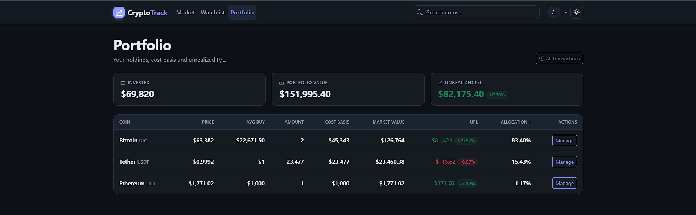

# CryptoTrack

A cryptocurrency portfolio tracker that reconstructs your holdings from a buy/sell
ledger to show real cost basis and **unrealized profit/loss** — not just live prices.

<!--
Screenshot placeholder. Drop docs/screenshot.png (portfolio overview: the stat
tiles + holdings table) and this renders automatically. See docs/README.md.
-->


**[▶ Live demo](https://cryptotrack.leivermoreno.com/)** — browse the market, build a watchlist, and record
transactions.

## Why I built it

Most price sites tell you what a coin is worth right now, but not what *you're* up or
down. Answering that means tracking every buy and sell, matching sells against the
right lots, and separating what you paid from what it's worth today.

I built CryptoTrack to do exactly that: you record transactions, and it replays them
into open positions using FIFO lot accounting to compute your cost basis, average buy
price, and unrealized P/L. It's a personal project — a focused, server-rendered Django
app rather than a broad exchange clone.

## Tech stack

- **Backend:** Python 3.12, Django 5.2
- **Database:** PostgreSQL
- **Frontend:** Server-rendered Django templates, Bootstrap 5, django-crispy-forms,
  and a small custom CSS design system with dark mode (no JS framework)
- **Market data:** CoinGecko API
- **Infra:** Docker (multi-stage), Railway, Gunicorn, WhiteNoise, APScheduler
- **Tooling:** Ruff, pre-commit

## Features

- **Live market table** — coins ranked by market cap with price, 24h/7d change, ATH,
  volume, and market cap. Every column is sortable; large figures use compact
  formatting (`$1.2T`, `$45.6B`); paginated.
- **Search** — case-insensitive match on coin name or symbol.
- **Watchlist** — one-click add/remove toggle, per user.
- **Portfolio overview** — summary tiles for invested cost basis, current value, and
  unrealized P/L, plus a holdings table with average buy price, cost basis, market
  value, per-position P/L, and allocation %.
- **Transaction ledger** — record buys and sells with amount, price, and trade date;
  per-coin history with edit and delete. Sells that would oversell a position are
  rejected, and you can't add to a delisted coin.
- **Accounts** — registration, login/logout, and password change.
- **Admin** — read-only transaction audit log and a coin catalog where the only
  editable field is `is_active`, used to hide delisted coins.

The interface is table- and stat-tile-based; there are no client-side price charts.

## Challenges & decisions

The interesting engineering here isn't the CRUD — it's the accounting correctness and
the failure modes around a third-party API.

- **FIFO portfolio accounting.** Cost basis and unrealized P/L only make sense if
  sells consume the *right* lots. `portfolio/services.py` replays each coin's
  transactions into a FIFO queue of open lots; `portfolio/ledger.py` enforces the
  invariants (no overselling at any point in the timeline, no buying into a delisted
  coin) under row-level `select_for_update` locks so two concurrent requests can't
  race a position negative.

- **Graceful degradation when CoinGecko is down.** The client in `coins/services.py`
  uses per-request connect/read timeouts and bounded retry/backoff on idempotent GETs
  (retrying 429/5xx and honoring `Retry-After`), and wraps every transport/status
  failure in a typed `CoinGeckoError`. Views catch it and render an in-place "market
  data unavailable" banner at HTTP 200 (`common/utils.py`) instead of a 500 — the page
  stays usable, the scheduler logs and skips.

- **DB-backed cache, deliberately (not Redis).** Market data is memoized in Postgres
  via Django's `DatabaseCache` (the coin catalog ~2h, market pages ~60s). It only holds
  a couple of short-lived keys that all degrade gracefully on a miss, and Postgres
  already shares it across the web and worker processes — so adding Redis would mean one
  more required service for no real benefit at this scale.

- **PostgreSQL only, even for tests.** There's no SQLite fallback. Financial code leans
  on `Decimal`/numeric behavior and constraints where engines differ, so tests run
  against the same engine as production to avoid passing locally and breaking in prod.

- **A polished UI without a JS framework.** The frontend is plain Django templates plus
  a custom CSS token system (`static/style.css`): no-flash dark mode set before first
  paint, mobile-first responsive tables that hide non-essential columns on narrow
  screens, and consistent empty states — kept intentionally dependency-light.

**Architecture at a glance:** four Django apps — `coins` (market data + watchlist),
`portfolio` (transactions + P/L), `accounts` (auth), and `common` (shared helpers).
Two processes share one database: a `web` server (Gunicorn, WhiteNoise for static) and
an optional `worker` (APScheduler) that re-syncs the CoinGecko coin catalog. Request
flow is CoinGecko → DB cache → view. Liveness is `GET /healthz`.

## Setup

Requires Python 3.12 and a running PostgreSQL. (For a containerized setup, skip to
[Deployment → Docker](#docker).)

```bash
# 1. Clone and enter
git clone https://github.com/leivermoreno/cryptotrack.git
cd cryptotrack

# 2. Virtualenv + dependencies (dev file = runtime + Ruff/pre-commit)
python -m venv venv
source venv/bin/activate            # Windows: venv\Scripts\activate
pip install -r requirements-dev.txt

# 3. PostgreSQL: create the role and database
#    - role "crypto_track", database "crypto_track" owned by it
#    - grant CONNECT on the "postgres" database to the role (needed to run tests)

# 4. Configure env (see Configuration below)
cp .env.example .env                # then edit values

# 5. Initialize
python manage.py migrate
python manage.py createcachetable   # DB-backed cache table (once)
python manage.py sync_supported_coins  # populate the Coin table from CoinGecko (required once)
python manage.py createsuperuser    # optional, for the admin panel

# 6. Run
python manage.py runserver          # http://localhost:8000
```

`sync_supported_coins` must run at least once before the app is usable — search,
watchlist, and portfolio all resolve local `Coin` rows. To keep the catalog fresh
afterward, run the scheduler in a separate process:

```bash
python manage.py runapscheduler     # blocking; re-syncs the catalog every ~2h
```

---

## Configuration

Configuration comes from a `.env` file in the project root (loaded via python-dotenv)
or the process environment. See [`.env.example`](.env.example) for a template.

| Variable | Required | Notes |
| --- | --- | --- |
| `SECRET_KEY` | Prod (dev has an insecure fallback) | Django secret key; read at settings load. |
| `DJANGO_DEBUG` | No (default off) | `true` for local dev/tests/CI. Unset/false = production posture, which makes `SECRET_KEY`, `ALLOWED_HOSTS`, and `CSRF_TRUSTED_ORIGINS` required. A non-boolean value fails closed. |
| `CSRF_TRUSTED_ORIGINS` | Prod | Comma-separated origins incl. scheme (e.g. `https://example.com`). Dev defaults to localhost. |
| `ALLOWED_HOSTS` | Prod | Comma-separated hostnames. Dev defaults to `localhost,127.0.0.1`. |
| `COINGECKO_KEY` | Runtime (for market data) | Optional at import; required for any CoinGecko request. |
| `DATABASE_URI` | No | Parsed by `dj-database-url`. Defaults to `postgres://crypto_track@/crypto_track`. |
| `LOG_LEVEL` | No | `DEBUG`/`INFO`/`WARNING`/`ERROR`/`CRITICAL`; default `INFO`; unrecognized fails closed. |

### Production security knobs

These apply only when `DEBUG` is off, and all have safe defaults, so they can be left
unset. The app targets a Railway/PaaS deployment where TLS terminates at the platform
edge and requests reach the app over plaintext HTTP.

- **`TRUST_PROXY_SSL_HEADER`** (default `false`) — trust `X-Forwarded-Proto` to
  determine the request scheme. **Set `true` on Railway/any TLS-terminating proxy:**
  otherwise Django treats every request as insecure and `SECURE_SSL_REDIRECT` loops on
  `301`s. Only enable it behind a proxy that overwrites client-supplied
  `X-Forwarded-Proto` — the header is otherwise spoofable.
- **`SECURE_SSL_REDIRECT`** (default `true`) — redirect HTTP → HTTPS. Set `false` only
  as an incident kill-switch (e.g. to break a redirect loop while debugging proxy
  config).
- **`SECURE_HSTS_SECONDS`** (default `3600` = 1h) — HSTS max-age. HSTS is a hard-to-
  reverse browser commitment; ramp up only once HTTPS is proven stable
  (1h → 1d → 1wk → 1yr / `31536000`).
- **`SECURE_HSTS_INCLUDE_SUBDOMAINS`** / **`SECURE_HSTS_PRELOAD`** (both default
  `false`) — keep off until HSTS has run at a long max-age; preload is effectively
  irreversible.

`SESSION_COOKIE_SECURE` and `CSRF_COOKIE_SECURE` are hardcoded on in production.

## Deployment

The app is built for a Railway/PaaS deployment where TLS terminates at the platform
edge. Process entrypoints are declared in the [`Procfile`](Procfile); all environment
variables are injected by the platform (a local `.env` is loaded only when present).

### Docker

A single multi-stage [`Dockerfile`](Dockerfile) defines two targets sharing one `base`
stage (so interpreter, OS packages, and layer order never drift between environments):

- **`prod`** — the final stage, so `docker build .` and Railway both produce it.
  Installs only `requirements.txt` into an isolated venv, bakes hashed static assets in
  at build time (`collectstatic`), runs as a non-root `app` user, and starts Gunicorn
  bound to `$PORT`.
- **`dev`** — adds dev tooling and runs Django's autoreloading `runserver`. The source
  is bind-mounted by [`docker-compose.yml`](docker-compose.yml), which also starts
  Postgres and the scheduler `worker`, mirroring the prod topology locally:

```bash
docker compose up                                   # Postgres + web (autoreload) + worker
docker compose run --rm web python manage.py test   # run the suite in the container
docker build --target prod -t cryptotrack:prod .    # build the production image
```

### Railway

Railway builds from the Dockerfile via [`railway.json`](railway.json)
(`builder: DOCKERFILE`) and health-checks `/healthz`. Two points when deploying:

- Create **two services from the same repo/image**: `web` uses the default start
  command; `worker` overrides its start command to `python manage.py runapscheduler`
  (no healthcheck).
- Settings read the DSN from **`DATABASE_URI`**, but an attached Railway Postgres
  exposes `DATABASE_URL`. Set `DATABASE_URI=${{Postgres.DATABASE_URL}}` (a reference
  variable) on each service, and set `TRUST_PROXY_SSL_HEADER=true`.

### Processes

Two independent processes in the [`Procfile`](Procfile), sharing one database:

- **`web`** (`gunicorn crypto_track.wsgi:application`) — the only HTTP server.
  WhiteNoise serves static assets in-process (no CDN or reverse proxy).
- **`worker`** (`python manage.py runapscheduler`) — a separate, blocking APScheduler
  process that refreshes the coin catalog every ~2h and cleans up old scheduler-run
  records. Optional (the web app runs without it), but without it the `Coin` table is
  never re-synced after the initial seed. Run **at most one** instance.

### Release steps

Run once per deploy (or once ever, where noted), before `web` serves traffic. On the
Docker/Railway path, `collectstatic` is baked into the image at build and the rest run
as the Railway `preDeployCommand` ([`scripts/railway-predeploy.sh`](scripts/railway-predeploy.sh)):

1. `python manage.py migrate` — apply schema migrations.
2. `python manage.py createcachetable` — create the DB-backed `cache` table
   (idempotent; only strictly needed the first time).
3. `python manage.py collectstatic --noinput` — gather hashed assets for WhiteNoise
   (**baked into the prod image at build**, so not part of `preDeployCommand`).
4. `python manage.py sync_supported_coins` — seed the `Coin` table (suffixed with
   `|| true` in `railway.json` so a transient CoinGecko outage can't block a deploy).

### Static files

The project has a small, hand-maintained set of static assets (`static/style.css` plus
Django admin's bundled files), served from the web process by
[WhiteNoise](https://whitenoise.readthedocs.io/) rather than a CDN. In development,
`runserver` serves them directly (no `collectstatic` needed). In production, WhiteNoise
serves them compressed and content-hashed (`CompressedManifestStaticFilesStorage`) with
far-future, immutable cache headers.

### Cache

Django's `DatabaseCache`, stored in the `cache` table of the same PostgreSQL database
(no Redis/memcached). It memoizes two short-lived CoinGecko payloads; misses degrade
gracefully, and Postgres shares the cache across the `web` and `worker` processes.
Create the table once with `createcachetable`.

### Health check, logging, secrets

- **`GET /healthz`** — a dependency-free liveness endpoint returning plain `200 ok`. It
  is exempt from the HTTPS redirect (`SECURE_REDIRECT_EXEMPT`), so an internal-HTTP
  probe without `X-Forwarded-Proto: https` won't get a `301`.
- **Logging** — written to stdout via a self-contained `LOGGING` config; level tunable
  with `LOG_LEVEL`.
- **Secrets** — all from the environment. In production, `SECRET_KEY`, `ALLOWED_HOSTS`,
  and `CSRF_TRUSTED_ORIGINS` are required; `COINGECKO_KEY` is required at runtime for
  market data; on Railway set `TRUST_PROXY_SSL_HEADER=true`.

## Testing

Tests run against a temporary `test_*` PostgreSQL database that Django creates and drops
automatically, so a running PostgreSQL instance and the `CONNECT` privilege from
[Setup](#setup) are required.

```bash
python manage.py test               # full suite
python manage.py test coins         # single app
```

## Development

Ruff and pre-commit are installed by `requirements-dev.txt` (dev-only; not in the
runtime `requirements.txt`).

```bash
ruff check .                        # lint
ruff check --fix .                  # apply safe fixes, including import sorting
ruff format .                       # format

pre-commit install                  # install commit + pre-push hooks
pre-commit run --all-files          # run commit hooks across the repo
```

The commit hook sorts imports and formats with Ruff; the push hook runs the test suite.
To confirm a clean checkout is correctly configured, run
[`scripts/verify_setup.sh`](scripts/verify_setup.sh), which executes `check` → `migrate`
→ `createcachetable` → `test` in order and stops at the first failure.
